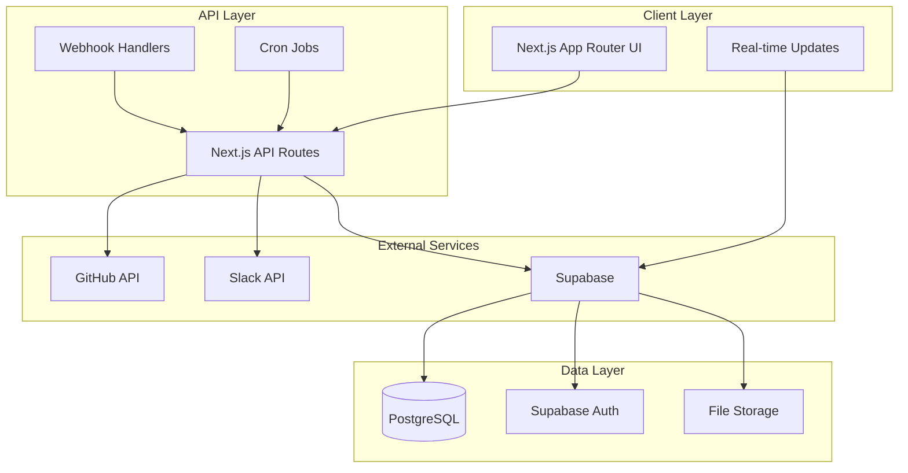

# Design Document

## Overview

Orbit is architected as a modern Next.js 14+ web application using the App Router pattern, with Supabase as the backend-as-a-service provider. The system follows a modular monolith approach where each of the four modules (AutoStand, PR Radar, Retro Arena, Debug Arcade) operates as a distinct feature domain while sharing common infrastructure and data models.

The application emphasizes real-time collaboration, automated workflows, and seamless integrations with developer tools. Built with TypeScript for type safety, Tailwind CSS for styling, and shadcn/ui for consistent component design, the platform provides a cohesive user experience across all modules.

## Architecture

### High-Level Architecture



### Technology Stack

- **Frontend**: Next.js 14+ with App Router, TypeScript, Tailwind CSS, shadcn/ui
- **Backend**: Next.js API Routes, Supabase (PostgreSQL, Auth, Real-time)
- **Authentication**: Supabase Auth with GitHub OAuth
- **Integrations**: GitHub REST/GraphQL API, Slack Web API
- **Deployment**: Vercel with automatic deployments
- **Cron Jobs**: Vercel Cron Jobs for daily standups and stale PR alerts
- **Monitoring**: Built-in Next.js analytics and custom telemetry

### Module Architecture

Each module follows a consistent structure:

```
src/
├── app/
│   ├── (modules)/
│   │   ├── standups/
│   │   ├── pr-radar/
│   │   ├── retro/
│   │   └── arcade/
│   └── api/
│       ├── standups/
│       ├── prs/
│       ├── retro/
│       └── arcade/
├── lib/
│   ├── modules/
│   │   ├── autostand/
│   │   ├── pr-radar/
│   │   ├── retro/
│   │   └── arcade/
│   ├── integrations/
│   └── shared/
└── components/
    ├── modules/
    └── ui/
```

## Components and Interfaces

### Core Components

#### Authentication & Authorization

- **AuthProvider**: Manages Supabase auth state and GitHub OAuth flow
- **ProtectedRoute**: HOC for route-level authentication
- **TeamSelector**: Allows users to switch between organizations
- **RoleGuard**: Component-level authorization based on user roles

#### Navigation & Layout

- **AppShell**: Main application layout with sidebar navigation
- **ModuleNav**: Sidebar navigation with keyboard shortcuts (g+s, g+p, etc.)
- **ThemeProvider**: Dark/light mode toggle with system preference detection
- **CommandPalette**: Global search and quick actions (Cmd+K)

#### Real-time Infrastructure

- **RealtimeProvider**: Supabase real-time subscription management
- **LiveUpdates**: Component for displaying real-time data changes
- **CollaborationCursor**: Shows other users' cursors in collaborative features

### Module-Specific Components

#### AutoStand Module

- **StandupCard**: Individual team member standup display
- **ActivityTimeline**: Visual representation of GitHub activity
- **PostNowButton**: Manual trigger for standup generation
- **StandupHistory**: Historical view of team standups

#### PR Radar Module

- **PRScoreCard**: Displays PR with risk score and metadata
- **ReviewerSuggestions**: Shows suggested reviewers with reasoning
- **PRFilters**: Advanced filtering by repo, author, risk level
- **StaleAlerts**: Dashboard for overdue pull requests

#### Retro Arena Module

- **RetroBoard**: Main collaborative board interface
- **StickyNote**: Individual note component with drag-and-drop
- **VotingInterface**: Dot voting system with real-time updates
- **ExportDialog**: Modal for exporting retro results

#### Debug Arcade Module

- **CodeEditor**: Monaco-based editor with syntax highlighting
- **TestRunner**: Real-time test execution and feedback with sandboxed execution
- **Leaderboard**: Ranking display with filtering options
- **ChallengeCard**: Individual challenge preview and metadata

**Arcade Security**: Code execution denies dangerous Node.js modules (`fs`, `net`, `child_process`, `vm` escapes) and runs in isolated workers with strict time and memory quotas.

### API Interface Design

#### RESTful API Structure

```typescript
// Authentication
POST /api/auth/github-callback
GET  /api/auth/me

// AutoStand
GET  /api/standups?member_id&date_from&date_to&limit&cursor&order_by&order_dir
POST /api/standups/generate
POST /api/standups/post-to-slack

// PR Radar
GET  /api/prs?status&repo&author&risk_min&limit&cursor&order_by&order_dir
POST /api/prs/score
GET  /api/prs/suggestions/:pr_id

// Retro Arena
GET  /api/retros?status&created_by&limit&cursor&order_by&order_dir
POST /api/retros
POST /api/retros/:id/notes
PUT  /api/retros/:id/notes/:note_id/vote
POST /api/retros/:id/export

// Debug Arcade
GET  /api/arcade/levels?limit&cursor&order_by&order_dir
POST /api/arcade/run
GET  /api/arcade/leaderboard?limit&cursor&order_by&order_dir

// Webhooks
POST /api/webhooks/github
POST /api/webhooks/slack
```

**API Design Principles**: All list endpoints support pagination via `limit` and `cursor` parameters, plus sorting via `order_by` and `order_dir` for consistent data access patterns.

#### WebSocket Events

```typescript
// Real-time events via Supabase
type RealtimeEvent =
	| { type: "retro_note_added"; payload: RetroNote }
	| { type: "retro_vote_cast"; payload: { noteId: string; votes: number } }
	| { type: "pr_updated"; payload: PRInsight }
	| { type: "standup_posted"; payload: Standup }
	| { type: "arcade_run_completed"; payload: ArcadeRun };
```

## Data Models

### Core Entities

```typescript
interface Organization {
	id: string;
	name: string;
	settings: {
		timezone: string;
		slack_webhook_url?: string; // Default webhook; specific integrations stored in Integration table
		github_org?: string;
	};
	created_at: string;
	deleted_at?: string;
}

interface Member {
	id: string;
	org_id: string;
	email: string;
	github_login?: string;
	github_id?: string;
	avatar_url?: string;
	slack_user_id?: string;
	role: "admin" | "member";
	created_at: string;
	deleted_at?: string;
}

interface Integration {
	id: string;
	org_id: string;
	type: "github" | "slack";
	access_token?: string;
	settings: Record<string, any>;
	created_at: string;
	deleted_at?: string;
}
```

### Module-Specific Models

```typescript
// AutoStand
interface Standup {
	id: string;
	org_id: string;
	member_id: string;
	date: string;
	yesterday: string[];
	today: string[];
	blockers: string[];
	raw_github_data: any;
	created_at: string;
}

// PR Radar
interface PRInsight {
	id: string;
	org_id: string;
	repo: string;
	number: number;
	author_member_id?: string;
	additions: number;
	deletions: number;
	files_changed: number;
	tests_changed: number;
	touched_paths: string[];
	size_score: number;
	risk_score: number;
	suggested_reviewers: string[];
	status: "open" | "merged" | "closed";
	opened_at: string;
	updated_at: string;
}

// Retro Arena
interface Retro {
	id: string;
	org_id: string;
	title: string;
	sprint?: string;
	status: "planning" | "active" | "voting" | "completed" | "archived";
	created_by: string;
	created_at: string;
}

interface RetroNote {
	id: string;
	retro_id: string;
	author_member_id?: string;
	column_key: "went_well" | "went_poorly" | "ideas" | "action_items";
	text: string;
	color: string;
	votes: number;
	is_anonymous: boolean;
	created_at: string;
}

// Debug Arcade
interface ArcadeLevel {
	id: string;
	slug: string;
	title: string;
	description: string;
	language: "typescript" | "python";
	difficulty: "easy" | "medium" | "hard";
	starter_code: string;
	test_cases: string;
	solution: string;
	created_at: string;
}

interface ArcadeRun {
	id: string;
	level_id: string;
	member_id: string;
	submitted_code: string;
	passed: boolean;
	duration_ms: number;
	points_awarded: number;
	test_output: string;
	created_at: string;
}
```

### Database Schema Design

The database uses PostgreSQL with Row Level Security (RLS) policies to ensure data isolation between organizations. Key design decisions:

- **UUID Primary Keys**: For security and distributed system compatibility
- **Soft Deletes**: Preserve data integrity for audit trails using `deleted_at` timestamps
- **JSONB Fields**: Flexible storage for integration-specific data
- **Composite Indexes**: Optimized for common query patterns
- **Foreign Key Constraints**: Maintain referential integrity

**Integration Storage Strategy**: Webhook URLs and access tokens are primarily stored in the `Integration` table for proper security and audit trails. The `Organization.settings.slack_webhook_url` field serves as a convenience default for organizations with simple single-channel setups, but specific integrations should use the dedicated Integration records.

**Soft Delete Support**: All core tables (Organization, Member, Integration) implement soft deletes via `deleted_at` timestamps to preserve data integrity and maintain audit trails without losing referential relationships.

**Reliability & Operations**:

- **Idempotency**: Webhook handlers are idempotent via delivery_id de-duplication; cron jobs use a job_lock table to avoid double execution
- **Data Retention**: Raw integration payloads retained 30 days; aggregated metrics kept indefinitely
- **Backup Strategy**: Automated daily backups with point-in-time recovery via Supabase
- **Feature Flags**: Boolean flags in `org.settings` gate experimental features like Notion export and Jira integration

## Error Handling

### API Error Responses

```typescript
interface APIError {
	error: {
		code: string;
		message: string;
		details?: any;
	};
	timestamp: string;
	request_id: string;
}

// Standard HTTP status codes
// 400: Bad Request (validation errors)
// 401: Unauthorized (authentication required)
// 403: Forbidden (insufficient permissions)
// 404: Not Found (resource doesn't exist)
// 429: Too Many Requests (rate limiting)
// 500: Internal Server Error (unexpected errors)
```

### Client-Side Error Handling

- **Error Boundaries**: React error boundaries for component-level error recovery
- **Toast Notifications**: User-friendly error messages with retry options following the APIError contract
- **Fallback UI**: Graceful degradation when features are unavailable
- **Offline Support**: Basic offline functionality with sync when reconnected
- **Consistent Error Format**: All client-side error handling uses the standardized APIError interface
- **Empty States & Onboarding**: Each module includes empty states, loading skeletons, and one-click 'seed demo data' for first-time users

### Integration Error Handling

- **GitHub API**: Rate limiting, token expiration, repository access errors
- **Slack API**: Webhook failures, message formatting errors, channel permissions
- **Supabase**: Connection timeouts, RLS policy violations, real-time disconnections

## Testing Strategy

### Unit Testing

- **Pure Functions**: PR scoring algorithms, standup formatting, data transformations
- **API Routes**: Request/response validation, business logic, error scenarios
- **Components**: Rendering, user interactions, prop handling
- **Utilities**: Date handling, text processing, validation functions

### Integration Testing

- **Database Operations**: CRUD operations, RLS policies, data consistency
- **External APIs**: GitHub/Slack integration mocking and contract testing
- **Authentication Flow**: OAuth callback handling, session management
- **Real-time Features**: WebSocket connections, event handling

### End-to-End Testing

- **User Workflows**: Complete user journeys through each module
- **Cross-Module Integration**: Data flow between different features
- **Performance Testing**: Load testing for concurrent users
- **Accessibility Testing**: Screen reader compatibility, keyboard navigation
- **Demo Data Testing**: Reliable E2E tests using seeded demo data via scripts/seed-demo.ts

### Testing Tools

- **Vitest**: Unit and integration testing framework
- **Playwright**: End-to-end browser testing
- **MSW**: API mocking for development and testing
- **Testing Library**: Component testing utilities

## Security Considerations

### Authentication & Authorization

- **OAuth 2.0**: Secure GitHub authentication flow
- **JWT Tokens**: Stateless authentication with Supabase
- **Role-Based Access**: Organization-level permissions
- **Session Management**: Secure token storage and refresh

### Data Protection

- **Row Level Security**: Database-level access control
- **Input Validation**: Zod schemas for all API inputs
- **SQL Injection Prevention**: Parameterized queries only
- **XSS Protection**: Content Security Policy headers

### Integration Security

- **Webhook Verification**: GitHub webhook signature validation using X-Hub-Signature-256
- **Token Encryption**: Secure storage of integration tokens
- **Rate Limiting**: Prevent API abuse and DoS attacks
- **CORS Configuration**: Restrict cross-origin requests

### Deployment Security

- **Environment Variables**: Secure secret management
- **HTTPS Only**: Force secure connections
- **Security Headers**: HSTS, CSP, X-Frame-Options
- **Dependency Scanning**: Automated vulnerability detection
- **Privacy-First Telemetry**: PII-free telemetry collection focusing on usage signals rather than sensitive logs
- **Threat Model**: Primary threats include token leakage, webhook spoofing, and RLS bypass. Mitigations: KMS-encrypted tokens, HMAC verification, and strict RLS policies with comprehensive test coverage
